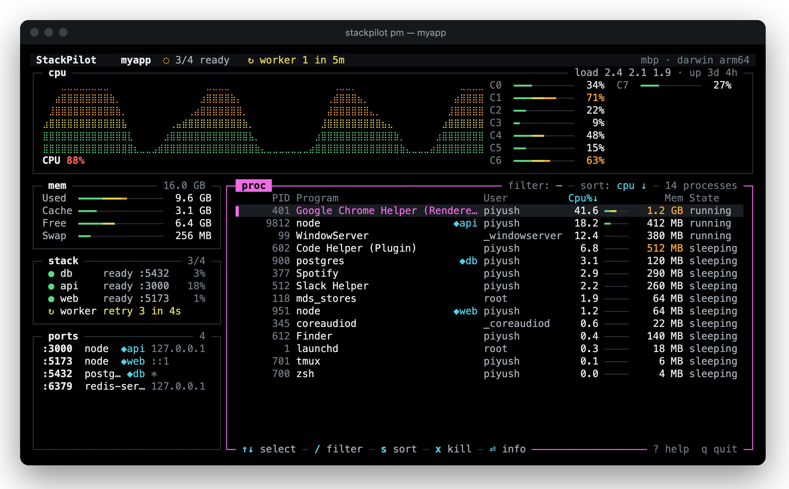
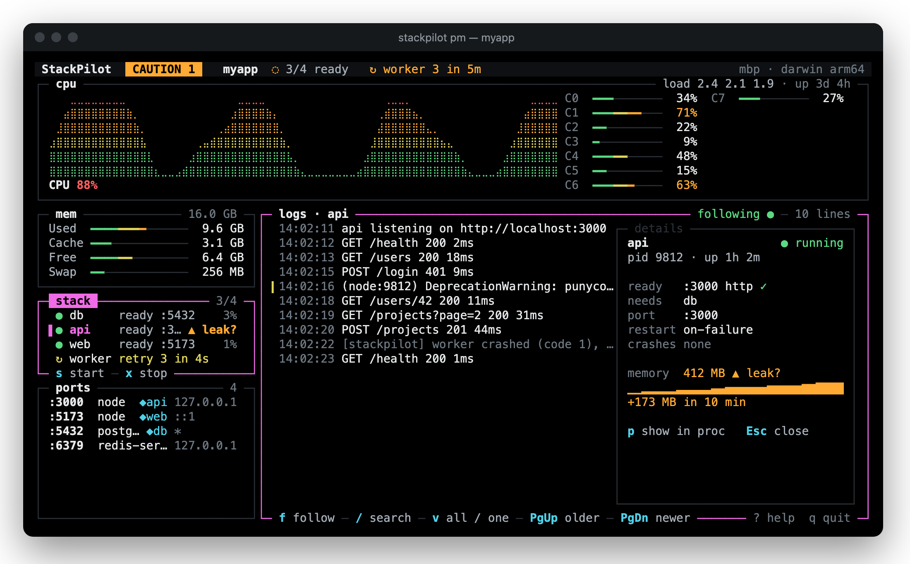

<h1 align="center">StackPilot</h1>

<p align="center">
  <b>htop and pm2 in one terminal app.</b><br>
  See what is using your machine, and run your project's processes, from one screen.
</p>

<p align="center">
  <a href="https://www.npmjs.com/package/stackpilot-tui"></a>
  <a href="https://github.com/PiyushY111/StackPilot/actions/workflows/ci.yml"></a>
  <a href="LICENSE"></a>
  
</p>

<p align="center">
  <code>npm install -g stackpilot-tui</code>
</p>

<p align="center">
  <a href="#install">Install</a> ·
  <a href="#quick-start">Quick start</a> ·
  <a href="#features">Features</a> ·
  <a href="#running-a-stack">Running a stack</a> ·
  <a href="#reference">Reference</a> ·
  <a href="docs/CONFIG.md">Configuration</a> ·
  <a href="CHANGELOG.md">Changelog</a>
</p>

<p align="center">
  
</p>

---

Running a project usually means a terminal tab per process (api, web, worker, a database), a system
monitor in another, and `lsof -i :3000` when a port is stuck. A crash in one tab goes unnoticed, and a
memory leak only shows up once the machine starts swapping.

**StackPilot puts all of it on one screen.** It shows what is using your machine, the way htop and btop
do, and it starts and supervises your project's processes, the way pm2 or foreman do. Because it does
both, it can tell you that *your* `api` is the process holding 1.2 GB and climbing, and which port it
listens on. It is one standalone binary for macOS and Linux, with nothing else to install.

## Features

<table>
<tr>
<td width="50%" valign="top">

**See the machine**<br>
CPU history and a gauge per core, memory and swap, listening ports with the process that owns each,
and a process table or tree with filter, sort, details, kill and renice.

</td>
<td width="50%" valign="top">

**Run your stack**<br>
Starts the processes in `stackpilot.json`, a Procfile or package.json scripts in dependency order,
waits until each is ready, restarts crashes with backoff, and stops everything cleanly.

</td>
</tr>
<tr>
<td valign="top">

**Follow it**<br>
A live logs panel per process, or all of them interleaved, with pause and search. Logs are saved to
`.stackpilot/logs/`, and each process shows the CPU and memory of its whole process tree.

</td>
<td valign="top">

**Notice trouble early**<br>
The screen stays quiet while everything is normal. A `CAUTION` or `WARNING` light comes on for a
process that keeps crashing, a failing data source, or memory that keeps climbing (`▲ leak?`).

</td>
</tr>
<tr>
<td valign="top">

**Stay safe**<br>
Every kill and renice is confirmed in the engine: one key for your own processes, the exact name for
system ones; StackPilot itself and PID 1 are blocked. After a crash, it offers to stop what it left running.

</td>
<td valign="top">

**Run anywhere**<br>
One binary with no runtime to install. Works over SSH, on an EC2 box or a Raspberry Pi, and in
256-colour, 16-colour and no-colour terminals.

</td>
</tr>
</table>

## Install

**npm** installs the `stackpilot` command, with no install scripts (npm picks the binary for your platform):

```sh
npm install -g stackpilot-tui
```

**Without npm**, a checksum-verifying installer puts it in `~/.local/bin` (set `STACKPILOT_INSTALL_DIR` to change that):

```sh
curl -fsSL https://raw.githubusercontent.com/PiyushY111/StackPilot/main/packaging/install.sh | sh
```

Or download an archive from the [releases page](https://github.com/PiyushY111/StackPilot/releases/latest).
Supported: macOS 13+ and Linux (glibc), on arm64 and x64.

<details>
<summary><b>Updating, and verifying what you installed</b></summary>

<br>

Update with `npm install -g stackpilot-tui@latest`, or with `stackpilot update` for a `curl` install
(it checks the checksum and the version before replacing the binary).

Every release is built by GitHub Actions from a tagged commit. The npm packages carry provenance, and
the archives carry build attestations:

```sh
npm audit signatures                                   # in a project with stackpilot-tui installed
gh attestation verify stackpilot-v<version>-<os>-<arch>.tar.gz --repo PiyushY111/StackPilot
```

</details>

## Quick start

```sh
stackpilot              # the dashboard: this machine, plus this folder's stack (idle until you start it)
cd my-project
stackpilot init         # writes stackpilot.json from a Procfile or package.json scripts
stackpilot pm           # starts the stack and opens the dashboard on it
```

Press `?` anywhere for every key, and `q` to quit. With a stack running, StackPilot asks first and stops
it cleanly. If something looks wrong, `stackpilot doctor` checks the machine, the terminal and the config.

## A closer look

<p align="center">
  
</p>

- **The header** names the stack and how many processes are ready. It lights `CAUTION` here because
  `worker` has crashed 3 times in 5 minutes, before StackPilot gives up on it.
- **The stack box** shows each process's status and readiness. `api` is marked `▲ leak?`: its memory has
  grown steadily for ten minutes.
- **The big panel** shows the selected process's logs while the stack box has focus. `⏎` opens its
  details: how it is checked for readiness, what it depends on, its port, restarts and memory.

Colour means one thing everywhere: **white** for normal values, **green · amber · red** for normal ·
caution · warning, **cyan** for what you chose (keys, sort, filters, your processes) and **magenta** for
what is active (the focused box and the selection). Every status also has a glyph (`●` running,
`↻` restarting, `✕` crashed, `⊘` blocked), so nothing depends on colour alone.

## Running a stack

A stack is the set of processes a project needs, described in `stackpilot.json`:

```json
{
  "version": 1,
  "processes": {
    "db":  { "cmd": "docker run --rm -p 5432:5432 -e POSTGRES_PASSWORD=dev postgres:16", "ready": { "port": 5432 } },
    "api": { "cmd": "npm run dev", "dependsOn": ["db"], "ready": { "http": "http://localhost:3000/health" } },
    "worker": { "cmd": "node worker.js", "dependsOn": ["api"], "restart": "always" }
  }
}
```

| | |
|---|---|
| **Where it comes from** | `--config`, then `stackpilot.json` in this folder or any parent, then a `Procfile`, then package.json scripts (you pick which). `stackpilot import pm2` converts a pm2 setup |
| **Order** | `dependsOn`: a process starts once everything it depends on is ready |
| **Ready** | A port, an HTTP URL, or a log line (`"log": "listening on"`) |
| **Restarts** | `on-failure` (the default), `always` or `never`, with backoff and a `maxRestarts` limit |
| **Environment** | `env` and `envFile`; values are masked in the UI until you reveal them |
| **Validation** | Every problem is reported with its path, and `stackpilot pm` exits with code 2, so the same check works in CI |

Every option and its default is in the [configuration reference](docs/CONFIG.md). To keep a stack
running after you log out of a server, run `stackpilot pm` inside `tmux`.

## How it compares

| | htop | btop | pm2 | foreman / overmind | **StackPilot** |
|---|:---:|:---:|:---:|:---:|:---:|
| System monitor | ✔ | ✔ | basic | ✘ | ✔ |
| Process tree and ports | tree only | tree only | ✘ | ✘ | ✔ |
| Start a whole stack in order | ✘ | ✘ | ✔ | ✔ | ✔ |
| Readiness checks | ✘ | ✘ | partial | ✘ | ✔ |
| Resource use per managed app | ✘ | ✘ | ✔ | ✘ | ✔ whole tree |
| Runtime needed | none | none | Node | Ruby / Go | **none** |

## Reference

<details>
<summary><b>Keys</b></summary>

<br>

| Where | Keys |
|---|---|
| Everywhere | `Tab` next box · `?` help · `Esc` back · `q` quit · `L` logs of a failed process |
| Process table | `↑↓` select · `/` filter · `s` sort (`S` reverse) · `t` tree · `⏎` details · `x` kill (`X` force) · `r` renice |
| Process tree | `←→` fold, plus the table's keys |
| Ports | `↑↓` select · `⏎` jump to the owner · `x` kill the owner · `/` filter |
| Stack | `↑↓` select · `⏎` details · `p` show in the process table · `s` start · `x` stop · `r` restart · `a` start all · `X` stop all · `n` new process · `e` env · `w` save to `stackpilot.json` |
| Logs | `f` follow · `/` search · `v` all processes or one · `PgUp`/`PgDn` scroll · `g`/`G` oldest/newest |

The focused box shows its most useful keys in its bottom border, and the help screen is generated from
the same key map, so it always matches. Arrows and `j`/`k` both move, which is why kill is `x`.

</details>

<details>
<summary><b>Commands and options</b></summary>

<br>

| Command | What it does |
|---|---|
| `stackpilot` | The dashboard. This folder's stack is shown idle; `a` starts it all, `s` starts one process |
| `stackpilot pm` | Starts this folder's stack and opens the dashboard on it |
| `stackpilot sm` | The system monitor only; never reads or runs a config |
| `stackpilot init` | Writes `stackpilot.json` from a Procfile, package.json scripts or a command you type |
| `stackpilot import pm2 [file]` | Converts a running pm2, or a pm2 ecosystem file, into `stackpilot.json` |
| `stackpilot doctor` | Checks what StackPilot needs here and says how to fix what is missing |
| `stackpilot update [--check]` | Updates a standalone install to the latest release |

| Option | Meaning |
|---|---|
| `--config <path>` | Use this `stackpilot.json` instead of searching for one |
| `--only <a,b>` | `pm`: start only these processes (and what they depend on) |
| `--interval <ms>` | Refresh interval, 250 to 60000 (default 1000) |
| `--force` | `init`, `import`: replace an existing `stackpilot.json` |
| `-y`, `--yes` | `init`: take the defaults; `import`: agree to read a `.js` ecosystem file |
| `--no-color` | Plain output (`NO_COLOR` is respected too) |
| `-h`, `--help` · `-v`, `--version` | Help and version |

`-pm`, `--pm`, `-sm` and `--sm` also work. `stackpilot sm --dump --ticks N` prints N JSON snapshots and
exits, which is handy for scripts.

</details>

<details>
<summary><b>Platforms and footprint</b></summary>

<br>

| | macOS 13 or newer | Linux (glibc) |
|---|---|---|
| **arm64** | Apple Silicon | AWS Graviton, Raspberry Pi (64-bit OS) |
| **x64** | Intel Macs | most servers and desktops |
| **Sampling** | Native (libproc); other users' processes every 5 s, since macOS limits those to root | `/proc` |

The full dashboard uses about 3% of one core and 80 MB. Windows works through WSL2; musl-based
distributions such as Alpine aren't supported yet.

</details>

<details>
<summary><b>Troubleshooting</b></summary>

<br>

- **Something looks wrong:** run `stackpilot doctor`. It checks the platform, sampling, ports, the
  terminal and your config, and says how to fix each problem. Include its output when you
  [open an issue](https://github.com/PiyushY111/StackPilot/issues/new/choose).
- **Other users' processes show no CPU or memory on macOS, or ports have no owner:** macOS only shares
  those with root. Run StackPilot with `sudo` to see everything.
- **`stackpilot-tui-<platform> is not installed`:** npm skipped the platform package because optional
  dependencies were turned off. Reinstall with `npm install -g stackpilot-tui --include=optional`.
- **The terminal is too small:** StackPilot needs at least 60×16 and is best at 100×30 or larger.

</details>

## Privacy and security

StackPilot sends no telemetry and has no analytics. It uses the network only for the readiness checks
you configure and when you run `stackpilot update`. Commands in a stack config run with your privileges
when you start the stack, the same trust model as `npm run`. Plain `stackpilot` never starts anything by
itself, and `stackpilot sm` never reads a config. Saved logs are readable only by you. Please report
security problems privately, as described in [SECURITY.md](SECURITY.md).

## Contributing

Issues and pull requests are welcome. Start with [CONTRIBUTING.md](CONTRIBUTING.md), and please follow
the [Code of Conduct](CODE_OF_CONDUCT.md). To work on it from source:

```sh
git clone https://github.com/PiyushY111/StackPilot.git && cd StackPilot
./setup.sh                 # macOS, Linux, Windows WSL2   ·   PowerShell: .\setup.ps1
npm run demo               # the process manager on a demo stack
```

`setup.sh` installs what's needed (Bun, dependencies, git hooks, and a `stackpilot` command linked to
your checkout), then runs lint, the type check and the tests. [docs/DEV.md](docs/DEV.md) lists every
development command.

| Document | What it covers |
|---|---|
| [docs/CONFIG.md](docs/CONFIG.md) | Every `stackpilot.json` option, with its default |
| [docs/UI_SPEC.md](docs/UI_SPEC.md) | The interface: layout, colours, keys and every screen state |
| [docs/PRD.md](docs/PRD.md) | What StackPilot is for, its requirements and the product decisions |
| [docs/BUILD_PLAN.md](docs/BUILD_PLAN.md) | The technical design: architecture, the engine/UI contract, performance, releases |
| [docs/DEV.md](docs/DEV.md) | Development commands, Linux testing on a Mac, measuring performance |
| [CHANGELOG.md](CHANGELOG.md) · [RELEASING.md](RELEASING.md) | What changed in each release, and how a release is made |

## License

[MIT](LICENSE) © 2026 [Piyush Yadav](https://github.com/PiyushY111)
